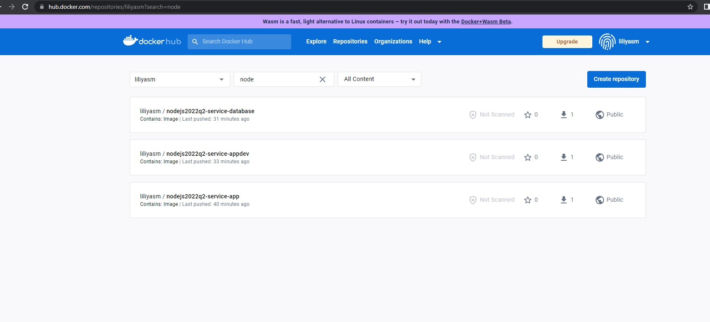

# Home Library Service


## Prerequisites

- Git - [Download & Install Git](https://git-scm.com/downloads).
- Node.js - [Download & Install Node.js](https://nodejs.org/en/download/) and the npm package manager.

## Downloading

```
git clone https://github.com/LiliyaSm/nodejs2022Q2-service.git
```

## Checkout to the develop branch:

```bash
 git checkout authentication
```

## Installing NPM modules

```
npm install
```

## Build

```
npm run docker:build
```

This will result in three docker images
smliliia/database - database
smliliia/appdev - application, development build
smliliia/app - application, production build


## Run in Development

```
npm run docker:dev
```

PSQL will be available at localhost

PSQL database will be stored at ./postgres-data folder

Application logs will be available both in console and at ./app-logs/app.log

Live-reload will be available for changes in ./src folder.


## Run in Production

```
npm run docker:prod
```

PSQL will not be accessible from localhost

PSQL database will be stored at ./postgres-data folder

Application logs will be available both in console and at ./app-logs/app.log

Live-reload won't be available, since image is optimized for production

## Images published

Images are published to docker hub


## Logs

Application logs are written to a folder "logs"

## Running application

After starting the app on port (4000 as default) you can open

in your browser OpenAPI documentation by typing http://localhost:4000/doc/.

For more information about OpenAPI/Swagger please visit https://swagger.io/.

## Testing

After application running open new terminal and enter:


To run all test with authorization

```
npm run test:auth
```

To run only specific test suite with authorization

```
npm run test:auth -- <path to suite>
```

### Auto-fix and format

```
npm run lint
```

```
npm run format
```

### Debugging in VSCode

Press <kbd>F5</kbd> to debug.

For more information, visit: https://code.visualstudio.com/docs/editor/debugging
